# MCP Manifesto — Agent-Native Tooling Principles

> **Version 2.0** — Extended with Architecture Reference, Canonical Project Structure, Implementation Patterns, Testing Strategy, and Publishing Checklist.
> This manifesto is also the foundation of the **[mcp-template](./mcp-template/)** — a ready-to-fork scaffold for building community MCP servers.

## 🧠 Purpose

This document defines the core principles, constraints, and best practices for designing high-quality MCP (Model Context Protocol) servers.

It is based on real-world experience building production-grade MCP systems, including large tool surfaces (50+ tools) and advanced LLM integration.

The goal is to build MCP servers that are:

- Reliable
- Predictable
- Debuggable
- Scalable
- Agent-friendly

---

## 📋 Sommaire

| | Section | Description |
|---|---|---|
| ⚖️ | [Philosophie de base](#core-philosophy) | MCP n'est pas une API, pas un agent — c'est un contrat |
| 🧩 | [15 Règles d'Or](#golden-rules) | Principes fondamentaux de conception |
| 🏗️ | [Architecture de référence](#architecture-reference) | Couches, flux de données, responsabilités |
| 📁 | [Structure du projet](#canonical-project-structure) | Arborescence canonique et règles non-négociables |
| 🔧 | [Patterns d'implémentation](#implementation-patterns) | Module, Output, Annotations, Description, Config, Erreurs |
| 🧪 | [Stratégie de test](#testing-strategy) | Cibles de couverture et patterns de tests |
| 📦 | [Checklist de publication](#publishing-checklist) | Documentation, qualité, conformité MCP, distribution |
| 🚫 | [Anti-patterns](#anti-patterns) | Ce qu'il ne faut jamais faire |
| 🧩 | [Template communautaire](#community-template) | Scaffold prêt à forker sur GitHub |

<details>
<summary><strong>Règles d'Or — détail (1–15)</strong></summary>

| # | Règle | Principe clé |
|---|---|---|
| 1 | [Prefer Atomic Tools](#1-prefer-atomic-tools) | Un outil = une seule action |
| 2 | [Do NOT Hide Orchestration](#2-do-not-hide-orchestration) | Toutes les étapes visibles du LLM |
| 3 | [Avoid Over-Aggregation](#3-avoid-over-aggregation) | Ne pas fusionner les outils |
| 4 | [Keep Inputs Minimal](#4-keep-inputs-minimal-and-focused) | Schémas d'entrée réduits et précis |
| 5 | [Prefer Explicitness](#5-prefer-explicitness-over-magic) | Pas de comportement caché |
| 6 | [Maintain Observability](#6-maintain-observability) | Chaque action traçable |
| 7 | [Use Structured Outputs](#7-use-structured-outputs) | `{ summary, data, suggestions, warnings }` |
| 8 | [Add Tool Metadata](#8-add-tool-metadata) | Annotations obligatoires sur chaque outil |
| 9 | [Limit Destructive Operations](#9-limit-destructive-operations) | Confirmation explicite requise |
| 10 | [Design for Large Tool Sets](#10-design-for-large-tool-sets) | Atomicité > réduction du nombre d'outils |
| 11 | [Guide, Do Not Control](#11-guide-do-not-control) | Descriptions et métadonnées, jamais de forçage |
| 12 | [Keep Determinism](#12-keep-determinism) | Comportement prévisible et reproductible |
| 13 | [Avoid Smart Routers](#13-avoid-smart-routers-with-hidden-logic) | Routage transparent uniquement |
| 14 | [Respect LLM Limitations](#14-respect-llm-limitations) | Tokens, schémas, hallucinations |
| 15 | [Optimize for Debuggability](#15-optimize-for-debuggability) | Chaque étape doit être compréhensible |

</details>

<details>
<summary><strong>Patterns d'implémentation — détail</strong></summary>

| Pattern | Description |
|---|---|
| [Tool Module Pattern](#tool-module-pattern-typescript) | Définitions + handler par domaine |
| [Output Contract](#output-contract) | Format JSON structuré pour tous les outils |
| [Tool Annotations Standard](#tool-annotations-standard) | 4 annotations obligatoires |
| [Tool Description Formula](#tool-description-formula) | WHAT · WHEN TO USE · BEST PRACTICES · AVOID |
| [Config & Auth Pattern](#config--auth-pattern) | Zod + AuthProvider interface |
| [Error Handling in Tools](#error-handling-in-tools) | Zod, erreurs attendues vs inattendues |

</details>

---

# ⚖️ Core Philosophy

## MCP is NOT an API wrapper

An MCP server is not just an API exposed to an LLM.

It is a **decision surface** for an agent.

Every design choice must reduce ambiguity and increase predictability.

---

## MCP is NOT an agent

The MCP server must NOT replace the LLM.

- No hidden reasoning
- No LLM calls inside tools
- No opaque orchestration

The MCP must remain **deterministic and observable**.

---

## MCP is a Contract

Each tool is a contract.

- Clear input
- Predictable output
- Explicit behavior

If a tool is ambiguous, the agent will fail.

---

# 🧩 Golden Rules

---

## 1. Prefer Atomic Tools

### Rule

Each tool must do ONE thing.

### Why

- Easier for the LLM to understand
- Easier to debug
- Lower cognitive load per decision

### Anti-pattern

"mega-tools" that try to handle multiple behaviors.

### Example

✅ Good:

- get_record
- get_audit_log

❌ Bad:

- get_record_with_audit_and_relations

---

## 2. Do NOT Hide Orchestration

### Rule

All steps must be visible to the LLM.

### Why

- Debugging becomes impossible otherwise
- The agent loses reasoning visibility

### Anti-pattern

"assistant" tools that internally call multiple tools without transparency.

---

## 3. Avoid Over-Aggregation

### Rule

Do NOT merge tools just to reduce their number.

### Why

- Larger schemas increase error rates
- LLM struggles with complex inputs
- Forces unnecessary data retrieval

### Example

❌ Bad:
get_audit_full(history + details)

✅ Good:
get_audit_log
get_audit_details

---

## 4. Keep Inputs Minimal and Focused

### Rule

Each tool must have a small, well-defined input schema.

### Why

- LLMs make fewer mistakes
- Easier parameter inference

### Anti-pattern

Tools requiring many optional parameters.

---

## 5. Prefer Explicitness Over Magic

### Rule

Never rely on hidden assumptions.

### Why

LLMs are probabilistic. Hidden behavior creates unpredictable outcomes.

### Example

❌ Bad:
"auto-detect everything"

✅ Good:
Explicit parameters and clear defaults

---

## 6. Maintain Observability

### Rule

Every action must be traceable.

### Why

- Debugging agent behavior
- Understanding failures

### Implementation

- Structured outputs
- Clear summaries
- No hidden execution

---

## 7. Use Structured Outputs

### Rule

Always return structured data.

### Format

```
{
  summary: string,
  data: any,
  suggestions?: string[],
  warnings?: string[]
}
```

### Why

- Helps LLM reasoning
- Enables chaining

---

## 8. Add Tool Metadata

### Rule

Every tool must include metadata.

### Required

- category
- readOnly
- destructive
- cost
- requiresConfirmation

### Why

- Better tool selection
- Safer operations

---

## 9. Limit Destructive Operations

### Rule

Destructive tools must require explicit confirmation.

### Why

- Prevent accidental data loss

---

## 10. Design for Large Tool Sets

### Rule

It is acceptable to have many tools.

### Why

- Atomicity is more important than tool count
- Modern MCP clients support 100+ tools

### Implication

Focus on clarity, not reduction.

---

## 11. Guide, Do Not Control

### Rule

Guide the agent with:

- descriptions
- metadata
- instructions

Do NOT force decisions.

---

## 12. Keep Determinism

### Rule

The MCP must behave predictably.

### Forbidden

- Randomness
- Hidden logic
- Internal LLM calls

---

## 13. Avoid Smart Routers (with hidden logic)

### Rule

Routing must be transparent.

### Why

Hidden routing removes control from the agent.

---

## 14. Respect LLM Limitations

### Rule

Design tools for LLM constraints.

### Consider

- Token limits
- Schema complexity
- Hallucinations

---

## 15. Optimize for Debuggability

### Rule

You must be able to understand every step.

### Why

Production MCP systems require observability.

---

# 🏗️ Architecture Reference

## Layer Model

Every MCP server follows a strict layered architecture. Each layer has exactly one responsibility.

```mermaid
flowchart TD
    Client["🖥️ MCP Client\n― Claude · GitHub Copilot · Cursor · VS Code ―"]
    Transport["🔌 Transport Layer\n― StdioServerTransport / SSEServerTransport ―"]
    Server["⚙️ MCP Server — @modelcontextprotocol/sdk\n― ListTools · CallTool · ListResources · ReadResource ―"]
    Registry["📦 Tool Registry\n― Map‹name, {definition, handler}› ―\nO(1) lookup · duplicate detection · listing"]
    ModA["📂 Tool Module A\n[domain].tools.ts"]
    ModB["📂 Tool Module B\n[domain].tools.ts"]
    ModC["📂 Tool Module C\n[domain].tools.ts"]
    Adapter["🔗 Client Adapter\n― your API / SDK ―\nauth · HTTP · retry · timeout"]

    Client    -->|"stdio / HTTP / SSE"| Transport
    Transport -->|"MCP Protocol"| Server
    Server    -->|dispatch| Registry
    Registry  --> ModA
    Registry  --> ModB
    Registry  --> ModC
    ModA      --> Adapter
    ModB      --> Adapter
    ModC      --> Adapter
```



## Data Flow (Call Tool)

```mermaid
sequenceDiagram
    participant C as MCP Client
    participant T as Transport
    participant S as Server
    participant R as Registry
    participant H as Handler
    participant Z as Zod
    participant A as Client Adapter

    C->>T: CallTool({ name, args })
    T->>S: forward request
    S->>R: getHandler(name)
    R-->>S: handler fn
    S->>H: handler(name, args, client)
    H->>Z: parse(args) — validate at boundary
    Z-->>H: validated args
    H->>A: client.doThing(...)
    A-->>H: result
    H-->>S: formatToolOutput(result)
    S-->>T: { content: [{ type: "text" }] }
    T-->>C: MCP response
```



## Layers vs Responsibilities

| Layer | File(s) | Responsibility |
|---|---|---|
| Transport | `server.ts` (wiring) | Parse stdio/HTTP, manage protocol lifecycle |
| Server | `server.ts` | Handle MCP protocol messages, dispatch |
| Registry | `tools/tool-registry.ts` | Index tools, detect duplicates, list definitions |
| Tool Modules | `tools/[domain].tools.ts` | Define schemas, validate input, call adapter, format output |
| Client Adapter | `[client]/client.ts` | Authenticate, HTTP, retry, timeout |
| Config | `config/config.schema.ts` | Zod schema, env loading, fail-fast validation |
| Auth | `auth/auth-provider.interface.ts` | Token acquisition, token refresh |

---

# 📁 Canonical Project Structure

```
my-mcp-server/
├── src/
│   ├── server.ts                     # Entry point — wires everything, no logic
│   ├── config/
│   │   ├── config.schema.ts          # Zod schema for all config values
│   │   └── config.loader.ts          # Loads + validates config from env
│   ├── auth/
│   │   ├── auth-provider.interface.ts  # AuthProvider port (interface)
│   │   └── [impl]-auth-provider.ts     # Auth adapter (e.g. device-code, client-cred)
│   ├── tools/
│   │   ├── tool-registry.ts          # ToolDefinition, ToolRegistry, ToolHandler types
│   │   ├── output.utils.ts           # formatToolOutput, formatData, formatList
│   │   ├── [domain-a].tools.ts       # One module per domain (read ops)
│   │   ├── [domain-b].tools.ts       # One module per domain (write ops)
│   │   └── ...
│   ├── [client]/
│   │   └── client.ts                 # Your API / SDK client adapter
│   └── resources/                    # Optional: MCP Resources
│       └── resource-provider.ts
├── tests/
│   ├── unit/                         # Pure logic, no network
│   │   └── [domain].tools.test.ts
│   └── integration/                  # Mocked HTTP / in-process server
│       └── [domain].integration.test.ts
├── scripts/
│   └── check-file-size.js            # Enforce 400-line limit
├── package.json
├── tsconfig.json
├── jest.config.js
├── eslint.config.js
├── .env.example                      # Secret template — never commit real values
├── server.json                       # MCP server manifest
├── README.md
└── CAPABILITIES.md                   # Human-readable tool catalogue
```

**Non-negotiable rules:**

- Max **400 lines per file** — enforced by ESLint rule + pre-commit hook
- One domain per `[domain].tools.ts` — never mix unrelated tools in one file
- `server.ts` contains **zero business logic** — wiring only
- Config is **always validated via Zod at startup** — fail fast before accepting connections
- Secrets **only from environment variables** — never in committed files

---

# 🔧 Implementation Patterns

## Tool Module Pattern (TypeScript)

Every tool module exports exactly two things:

1. An array of `ToolDefinition` objects (the schema — what the LLM sees)
2. A single `handler` function (the implementation — what runs)

```typescript
// src/tools/[domain].tools.ts
import { z } from "zod";
import type { MyClient } from "../client/client.js";
import { formatData, formatList } from "./output.utils.js";
import type { ToolResult } from "./tool-registry.js";

// ── Input Schemas (validate at the boundary) ─────────────────────────────────

const GetThingSchema = z.object({
  id: z.string().uuid("Must be a valid UUID"),
  fields: z.array(z.string()).optional(),
});

const ListThingsSchema = z.object({
  filter: z.string().optional(),
  top: z.number().int().min(1).max(100).default(25),
});

// ── Tool Definitions (the contract the LLM reasons against) ──────────────────

export const domainTools = [
  {
    name: "domain_get_thing",
    description: [
      "Retrieves a single thing by its UUID.",
      "WHEN TO USE: You have the exact ID and want specific fields — faster and more precise than domain_list_things with a filter.",
      "BEST PRACTICES: Always specify fields to limit payload size. Pass etag for subsequent updates.",
      "AVOID: Do not use for listing — use domain_list_things instead.",
    ].join(" "),
    inputSchema: {
      type: "object" as const,
      properties: {
        id: { type: "string", description: "UUID of the thing" },
        fields: {
          type: "array",
          items: { type: "string" },
          description: "Fields to return (omit = all)",
        },
      },
      required: ["id"],
    },
    annotations: {
      readOnlyHint: true,
      destructiveHint: false,
      idempotentHint: true,
      openWorldHint: true,
    },
  },
  {
    name: "domain_list_things",
    description: [
      "Lists things with optional filtering.",
      "WHEN TO USE: You need to discover records, search by criteria, or enumerate items.",
      "BEST PRACTICES: Apply filter to reduce result size; default top is 25.",
      "AVOID: Do not use when you already have the exact UUID — use domain_get_thing instead.",
    ].join(" "),
    inputSchema: {
      type: "object" as const,
      properties: {
        filter: { type: "string", description: "Optional filter expression" },
        top: { type: "number", description: "Max records to return (1-100, default 25)" },
      },
      required: [],
    },
    annotations: {
      readOnlyHint: true,
      destructiveHint: false,
      idempotentHint: false,
      openWorldHint: true,
    },
  },
];

// ── Handler (the single implementation function for this module) ──────────────

export async function handleDomainTool(
  name: string,
  args: unknown,
  client: MyClient,
): Promise<ToolResult> {
  switch (name) {
    case "domain_get_thing": {
      const { id, fields } = GetThingSchema.parse(args);
      const result = await client.getThing(id, fields);
      return formatData(
        `Thing ${id} retrieved successfully.`,
        result,
        ["Use domain_update_thing to modify fields on this record."],
      );
    }

    case "domain_list_things": {
      const { filter, top } = ListThingsSchema.parse(args);
      const items = await client.listThings({ filter, top });
      return formatList("things", items, [
        "Use domain_get_thing with an ID from this list for full details.",
      ]);
    }

    default:
      throw new Error(`Unknown tool: ${name}`);
  }
}
```

---

## Output Contract

Every tool MUST return this JSON shape — use `formatToolOutput` from `output.utils.ts`:

```json
{
  "summary": "Human-readable one-liner about what happened",
  "data": { "...": "..." },
  "suggestions": [
    "Optional: what the agent should do next",
    "Optional: related tools to call for follow-up"
  ],
  "warnings": [
    "Optional: non-fatal issues — truncation, pagination, partial results"
  ]
}
```

| Field | Required | Purpose |
|---|---|---|
| `summary` | ✅ always | First thing the LLM reads — must be actionable |
| `data` | ✅ always | The structured payload (focused, not raw API dumps) |
| `suggestions` | recommended | Guide the agent's next step — critical for workflow tools |
| `warnings` | situational | Surface non-fatal issues without failing the tool |

**Never include** secrets, tokens, passwords, or PII in any field.

---

## Tool Annotations Standard

All four annotations MUST be explicitly set on every tool definition:

| Annotation | Type | Meaning | Example tools |
|---|---|---|---|
| `readOnlyHint` | boolean | Tool only reads, no side-effects | `get_*`, `list_*`, `query_*` |
| `destructiveHint` | boolean | Permanently deletes or irreversibly mutates | `delete_*`, `purge_*` |
| `idempotentHint` | boolean | Same args → same result, safe to replay | `get_*`, `update_*` (PATCH semantics) |
| `openWorldHint` | boolean | Reaches outside the server (network, filesystem) | Almost all tools |

MCP clients use these to surface confirmation prompts and apply safety guards.

---

## Tool Description Formula

Every tool description MUST answer four questions in order:

```
[WHAT] One sentence on what the tool does.
[WHEN TO USE] Precise trigger condition — when should the agent pick this tool?
[BEST PRACTICES] Key constraints, required preconditions, ordering hints.
[AVOID] When NOT to call this — with an alternative tool name.
```

**Example:**
```
"Retrieves a single record by its UUID.
WHEN TO USE: You have the exact record ID and want specific fields — faster and more
precise than query_records with a GUID filter.
BEST PRACTICES: Always specify select to limit payload; pass etag for optimistic
concurrency on subsequent updates.
AVOID: Do not use for listing — use list_records instead."
```

---

## Config & Auth Pattern

```typescript
// src/config/config.schema.ts
import { z } from "zod";

export const ConfigSchema = z.object({
  apiUrl: z
    .string()
    .url()
    .startsWith("https://", { message: "Must use HTTPS" }),
  timeoutMs:  z.number().positive().default(30_000),
  maxRetries: z.number().min(0).max(10).default(3),
});

export type Config = z.infer<typeof ConfigSchema>;

// src/config/config.loader.ts
import { ConfigSchema, type Config } from "./config.schema.js";

export function loadConfig(): Config {
  return ConfigSchema.parse({
    apiUrl:     process.env.API_URL,
    timeoutMs:  process.env.TIMEOUT_MS  ? Number(process.env.TIMEOUT_MS)  : undefined,
    maxRetries: process.env.MAX_RETRIES ? Number(process.env.MAX_RETRIES) : undefined,
  });
}

// src/auth/auth-provider.interface.ts
export interface AuthProvider {
  /** Returns a valid access token, refreshing if necessary. */
  getAccessToken(): Promise<string>;
  /** True if the provider currently holds a valid (non-expired) token. */
  isAuthenticated(): boolean;
}
```

**Rules:**

- Config validated at startup — invalid config crashes the process before accepting connections
- All secrets from `process.env` — never hardcoded, never in committed files
- `AuthProvider` is an interface — swap `DeviceCodeAuthProvider` for `ClientCredentialAuthProvider` with zero tool changes
- Token refresh belongs in the auth provider, never in tool handlers

---

## Error Handling in Tools

```typescript
// In your tool handler switch case:
case "domain_get_thing": {
  const { id } = GetThingSchema.parse(args); // Zod throws on bad input → MCP error response

  try {
    const result = await client.getThing(id);
    return formatData(`Thing ${id} retrieved.`, result);

  } catch (error) {
    if (error instanceof NotFoundError) {
      // Expected error → return structured response with recovery hint
      return formatData(
        `Thing ${id} was not found.`,
        { error: "NOT_FOUND", id },
        ["Verify the ID exists with domain_list_things before retrying."],
      );
    }
    // Unexpected errors → re-throw (SDK wraps as MCP error response)
    throw error;
  }
}
```

| Error Type | Action | Why |
|---|---|---|
| Invalid input (bad UUID, missing field) | Let Zod throw | SDK returns structured MCP error |
| Expected API error (not found, conflict) | Return `formatData` with suggestions | Agent can recover intelligently |
| Unexpected error (timeout, 500) | Re-throw | Surfaces clearly, prevents silent failures |
| Auth failure | Throw with message | Client needs to fix auth, not retry |

**Never:** swallow errors silently. **Never:** expose stack traces or internal details to the agent.

---

# 🧪 Testing Strategy

## Test Coverage Targets

| Layer | Target | Rationale |
|---|---|---|
| Config schema | 100% | All valid/invalid combos — catches env mistakes |
| Tool definitions | 100% | Annotation completeness, name uniqueness |
| Tool handlers | ≥ 80% | Core paths, error branches, Zod rejection |
| Client adapter | ≥ 70% | HTTP retry, timeout, auth token injection |
| Full pipeline | key workflows | Tool → server → response round-trip |

## Test File Pattern

```typescript
// tests/unit/domain.tools.test.ts
import { domainTools, handleDomainTool } from "../../src/tools/domain.tools.js";
import { ToolRegistry } from "../../src/tools/tool-registry.js";

// ── Definition tests ──────────────────────────────────────────────────────────
describe("domainTools definitions", () => {
  it("registers without duplicate names", () => {
    const registry = new ToolRegistry();
    expect(() => registry.register({ tools: domainTools, handler: handleDomainTool }))
      .not.toThrow();
  });

  it("every tool has all four annotations", () => {
    for (const tool of domainTools) {
      expect(tool.annotations).toMatchObject({
        readOnlyHint:   expect.any(Boolean),
        destructiveHint: expect.any(Boolean),
        idempotentHint:  expect.any(Boolean),
        openWorldHint:   expect.any(Boolean),
      });
    }
  });
});

// ── Handler tests ─────────────────────────────────────────────────────────────
describe("handleDomainTool", () => {
  const mockClient = {
    getThing: jest.fn(),
    listThings: jest.fn(),
  };

  beforeEach(() => jest.clearAllMocks());

  it("domain_get_thing — returns summary and data", async () => {
    mockClient.getThing.mockResolvedValue({ id: "00000000-0000-0000-0000-000000000001", name: "Test" });

    const result = await handleDomainTool(
      "domain_get_thing",
      { id: "00000000-0000-0000-0000-000000000001" },
      mockClient as any,
    );

    const parsed = JSON.parse(result.content[0].text);
    expect(parsed.summary).toMatch(/retrieved/i);
    expect(parsed.data).toHaveProperty("id");
    expect(Array.isArray(parsed.suggestions)).toBe(true);
  });

  it("domain_get_thing — rejects invalid UUID", async () => {
    await expect(
      handleDomainTool("domain_get_thing", { id: "not-a-uuid" }, mockClient as any),
    ).rejects.toThrow();
  });
});
```

---

# 📦 Publishing Checklist

Before publishing to npm or the MCP registry:

### Documentation
- [ ] `README.md` — installation, configuration, quick start, tool catalogue
- [ ] `CAPABILITIES.md` — complete list of tools with descriptions and annotations
- [ ] `CHANGELOG.md` — version history with breaking change markers
- [ ] `.env.example` — all required env vars documented (no real values, no secrets)

### Code Quality
- [ ] `tsconfig.json` — `strict: true`, `noUncheckedIndexedAccess: true`
- [ ] All tests passing (`npm test`)
- [ ] Lint clean (`npm run lint`)
- [ ] Typecheck clean (`npm run typecheck`)
- [ ] No file exceeds 400 lines (`node scripts/check-file-size.js`)
- [ ] No secrets or tokens in any committed file (use `git-secrets` or `trufflehog`)

### MCP Compliance
- [ ] All tools have all four annotations set
- [ ] All tool descriptions follow the [WHAT / WHEN TO USE / BEST PRACTICES / AVOID] formula
- [ ] `server.json` — MCP server manifest (`name`, `version`, `description`, `configSchema`)
- [ ] Output always goes through `formatToolOutput` (never raw API responses)

### Distribution
- [ ] `package.json` — `"files"` array includes only dist, README, LICENSE, assets
- [ ] `npm pack --dry-run` — verify correct files included, no unexpected leaks
- [ ] Version bumped (`npm version patch|minor|major`)
- [ ] `npm publish --access public` then verify on registry

---

# 🚫 Anti-Patterns

---

## Mega Tool

A single tool doing everything.

Result:

- Hard to use
- Hard to debug

---

## Hidden Agent

MCP acting like an agent.

Result:

- Unpredictable behavior

---

## Overloaded Schemas

Too many parameters.

Result:

- LLM errors

---

## Implicit Behavior

Magic behavior without explanation.

Result:

- Confusion

---

## Tool Explosion Without Structure

Many tools but no organization.

Result:

- Poor discoverability

---

# 🧭 Design Principles Summary

- Atomicity > Simplicity
- Explicitness > Magic
- Observability > Automation
- Predictability > Intelligence
- Guidance > Control

---

# 🚀 Final Principle

A great MCP is not the smartest system.

It is the most predictable one.

Because predictability is what enables reliable agents.

---

# 🧩 Community Template

This manifesto ships with a **ready-to-fork template** at [`mcp-template/`](./mcp-template/).

It includes:

- All the architecture layers pre-wired
- `ToolRegistry`, `formatToolOutput`, `ToolDefinition` — ready to extend
- Annotated example tool module (`example.tools.ts`) — delete and replace
- Zod config + auth provider interface
- Jest test scaffold
- `scripts/check-file-size.js` — enforces the 400-line limit
- `SKILL.md` — a GitHub Copilot agent skill for building MCPs

**To start:**
```bash
# Clone / fork the template
cp -r mcp-template/ my-mcp-server/
cd my-mcp-server/
npm install
# Edit src/tools/example.tools.ts → your first domain
# Edit src/[client]/ → your API adapter
npm run build && npm test
```

---

# 🔄 Next Iterations

This manifesto is a living document.

It should evolve with:

- Real-world usage
- Failures
- Observations

The goal is continuous improvement toward agent-native systems.
